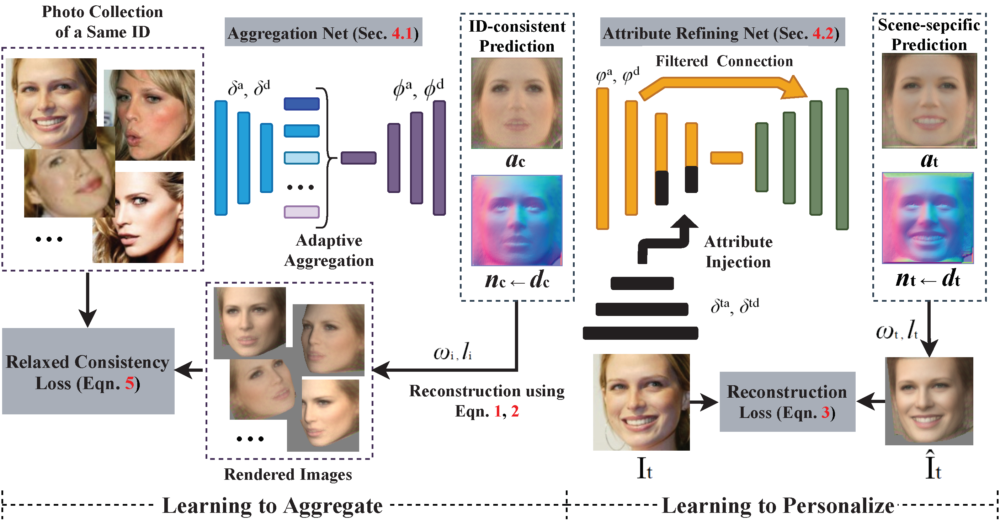

## Learning to Aggregate and Personalize 3D Face from In-the-Wild Photo Collection [Paper](https://openaccess.thecvf.com/content/CVPR2021/papers/Zhang_Learning_To_Aggregate_and_Personalize_3D_Face_From_In-the-Wild_Photo_CVPR_2021_paper.pdf) | [Arxiv](http://arxiv.org/abs/2106.07852)


Official pytorch implemetation of 'Learning to Aggregate and Personalize 3D Face from In-the-Wild Photo Collection'. 



## Introduction
This repository contains demo of LAP (Learning to Aggregate and Personalize) framework for reconstructing 3D face. Right now we provide an early version of demo for testing on in-the-wild images. The output size is 128 and the model is finetuned on CelebAMask-HQ Dataset.


## Requirments
The code is tested on pytorch 1.3.0 with torchvision 0.4.1
```
pip install torch==1.3.0
pip install torchvision==0.4.1
```

[Neural renderer](https://github.com/daniilidis-group/neural_renderer.git) is needed to render the reconstructed images or videos
```
pip install neural_renderer_pytorch
```

It may fail if you have a GCC version below 5. If you do not want to upgrade your GCC, one alternative solution is to use conda's GCC and compile the package from source. For example:
```
conda install gxx_linux-64=7.3
git clone https://github.com/daniilidis-group/neural_renderer.git
cd neural_renderer
python setup.py install
```

[Facenet](https://github.com/timesler/facenet-pytorch) is also needed to detect and crop human faces in images.
```
pip install facenet-pytorch
```

## DEMO
Download the [pretrained model](https://drive.google.com/file/d/1-Lr9V7T3G5xn1WAfR0F5Mh_rKRgdVs88/view?usp=sharing), and then run:

```
python demo.py --input ./images --result ./results --checkpoint_lap ./demo/checkpoint300.pth
```

Options:

--gpu: enable gpu

--detect_human_face: enable automatic human face detection and cropping using MTCNN provided in facenet-pytorch

--render_video: render 3D animations using neural_renderer (GPU is required)

## Note:
The output depth is transformed by several options and functions, including tanh(), depth_rescaler and depth_inv_rescaler for better visualization. You could search along these options to find the original output depth and rescale it to a required range.
The defined direction of normal in normal maps may be different to your required setting.
If you want to accelarate the inference procedure, you may delete the branches irrelavant to reconstruct depth, and set anti_aliasing=False in each renderer.

## License
The code contained in this repository is under MIT License and is free for commercial and non-commercial purposes. The dependencies, in particular, [neural-renderer-pytorch](https://github.com/daniilidis-group/neural_renderer), [facenet](https://github.com/timesler/facenet-pytorch), may have its own license.


## Citation
```
@InProceedings{Zhang_2021_CVPR,
    author    = {Zhang, Zhenyu and Ge, Yanhao and Chen, Renwang and Tai, Ying and Yan, Yan and Yang, Jian and Wang, Chengjie and Li, Jilin and Huang, Feiyue},
    title     = {Learning To Aggregate and Personalize 3D Face From In-the-Wild Photo Collection},
    booktitle = {Proceedings of the IEEE/CVF Conference on Computer Vision and Pattern Recognition (CVPR)},
    year      = {2021},
    pages     = {14214-14224}
}
```